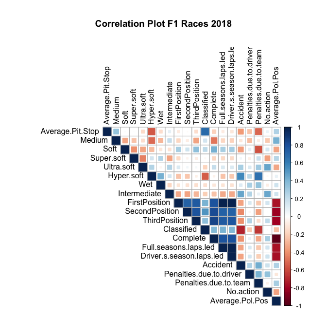

# Predicting Stroke from Electronic Health Records

With the spirit of reproducible research, this repository contains all the codes required to produce the results in the manuscript: 

> N. Jain\*, A. Patil\*, R. Agrahari, M. Hossari, S. Dev and J. D. Kelleher, Analysing F1 Race Car Outcomes, *under review*, 2020. (\* Authors contributed equally.)

Please cite the above paper if you intend to use whole/part of the code. This code is only for academic and research purposes.

*Correlation between the various F1 car race variables*

## Code Organization
All the code is written in R. 

### Code 
The script to reproduce all the figures, tables in the paper is `Nishtha_2018racing code.R`. Please run this script in R studio.

### Results and Contributions 
The three plots to explore the dataset - correlation plot, biplot and scree plot are all added in this repo. Additionally, to facilitate the analysis for this paper, the website - [racefans.net/2018-f1-season/2018-f1-statistics/](racefans.net/2018-f1-season/2018-f1-statistics/) - was scraped. Data from different pages on this website was combined into one csv for efficient use. This data can be found in `Combined_2018.csv`.
